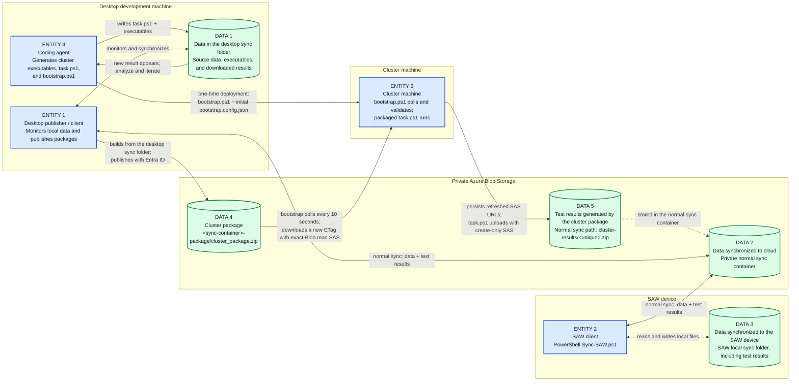

# SyncSAW agent guide

[Project overview](../README.md) | [User manual](USER-MANUAL.md) |
[Development guide](DEVELOPMENT-GUIDE.md) |
[Troubleshooting](TROUBLESHOOTING.md)

This guide is the entry point for coding agents that generate, package, deploy,
or validate cluster workloads. Before changing a cluster workflow, read:

1. The repository [agent safety harness](../AGENTS.md).
2. The
   [`generate-syncsaw-cluster-package` skill](../.github/skills/generate-syncsaw-cluster-package/SKILL.md).
3. The [`task.ps1` contract](../scripts/TASK-PS1.md).

The skill defines the package protocol. `AGENTS.md` and `TASK-PS1.md` define
mandatory safety restrictions.

## Agent responsibilities

The coding agent runs on the same development machine as the SyncSAW desktop
publisher. It:

1. Generates the stable `bootstrap.ps1` deployment script and initial external
   `bootstrap.config.json`.
2. Generates package-root `task.ps1`, cluster executables, test inputs, and
   supporting files.
3. Places package payload files in the desktop sync folder.
4. Waits for a new result ZIP in the local `cluster-results` folder.
5. Analyzes the results and publishes another iteration when needed.

The agent must not start, stop, restart, reinstall, or kill the desktop client;
restart a machine, node, service, or scheduled task; delete cloud Blobs for
validation; or modify existing cluster files. Generated `task.ps1` workloads
must create new files only.

## Entities and data flow

Blue rectangles are active **entities**. Green cylinders are stored **data**.
The lanes show where each entity runs and where each data item resides.



## Cluster package protocol

`scripts\bootstrap.ps1` is the stable Windows PowerShell 5.1 poller for cluster
machines that cannot use an Entra identity. The replaceable workload inside
each package is `task.ps1`. The cluster machine needs no PowerShell 7, Az
modules, Azure CLI, AzCopy, storage key, or interactive login.

The package has one fixed private Blob location:

```text
https://<account>.blob.core.windows.net/<sync-container>-package/cluster_package.zip
```

The desktop creates the `<sync-container>-package` container with public access
disabled and refuses to publish if the container is public. It builds
`cluster_package.zip` from the selected local folder, excluding `.syncsaw`,
`cluster-results`, reserved package/config names, and cluster-local
`PDITest/PDI.zip` and `PDITest/spdi.zip` datasets. It adds schema-5
`cluster_package.config` and uploads the package with the signed-in desktop
user's Entra credential.

Root `task.ps1` is package-only. Normal desktop and SAW synchronization exclude
it, and manual desktop upload rejects the root path. A nested file such as
`tools/task.ps1` remains ordinary sync data.

### Required protocol answers

| Agent question | Required answer |
| --- | --- |
| Where is the cluster package read? | `bootstrap.ps1` reads `PackageUri` from its external `bootstrap.config.json`. It must target `https://<account>.blob.core.windows.net/<sync-container>-package/cluster_package.zip`. |
| Which script is executed? | Only package-root `task.ps1`. `bootstrap.ps1` is the stable poller outside the package. |
| Where is the refreshed package-read SAS read? | From `PackageUri` in the downloaded package's schema-5 `cluster_package.config`. The poller validates and atomically persists it before task execution. |
| Where is the create-only result SAS read? | The poller persists packaged `ResultsBlobUri` to external `bootstrap.config.json` and passes that config path to `task.ps1` as `-BootstrapConfigPath`. |

## Provision the initial SAS URLs

Enable **Publish cluster package on changes and daily** in the desktop app and
run **Sync now** once. Copy `scripts\bootstrap.ps1` and
`scripts\bootstrap.config.json` to the cluster machine.

On the signed-in management computer, create the first seven-day exact-Blob
read-only package SAS and a matching exact-Blob create-only result SAS:

```powershell
$start = (Get-Date).ToUniversalTime().AddMinutes(-5)
$expiry = $start.AddDays(7)
az storage blob generate-sas `
  --account-name contosodata `
  --container-name releases-package `
  --name cluster_package.zip `
  --permissions r `
  --start $start.ToString('yyyy-MM-ddTHH:mm:ssZ') `
  --expiry $expiry.ToString('yyyy-MM-ddTHH:mm:ssZ') `
  --https-only --auth-mode login --as-user --full-uri --output tsv

$resultName = "cluster-results/initial-$([guid]::NewGuid().ToString('N')).zip"
az storage blob generate-sas `
  --account-name contosodata `
  --container-name releases `
  --name $resultName `
  --permissions c `
  --start $start.ToString('yyyy-MM-ddTHH:mm:ssZ') `
  --expiry $expiry.ToString('yyyy-MM-ddTHH:mm:ssZ') `
  --https-only --auth-mode login --as-user --full-uri --output tsv
```

Put both complete URLs in the cluster machine's `bootstrap.config.json`. Never
commit them or transfer them over an untrusted channel.

```json
{
  "PackageUri": "https://contosodata.blob.core.windows.net/releases-package/cluster_package.zip?sp=r&...",
  "ResultsBlobUri": "https://contosodata.blob.core.windows.net/releases/cluster-results/initial.zip?sp=c&...",
  "IntervalSeconds": 10,
  "TaskExecutionRoot": ""
}
```

Protect the file with Administrators/SYSTEM-only Windows ACLs, then start it
from elevated 64-bit Windows PowerShell 5.1:

```powershell
powershell.exe -NoLogo -NoProfile -ExecutionPolicy RemoteSigned -File `
  .\bootstrap.ps1
```

`TaskExecutionRoot` defaults to the directory containing `bootstrap.ps1`. An
explicit value must be that directory or one of its subdirectories. The runner
rejects network/removable drives and reparse points and protects each working
directory with Administrators/SYSTEM-only ACLs.

## Poll, roll over, and execute

The runner performs an HTTPS `HEAD` check every 10 seconds by default. A
matching ETag means no work. A changed ETag downloads only when Blob Last
Modified is strictly newer than the installed package. Downloads use
`If-Match` to reject a package that changes after the metadata check.

Before extraction, the runner limits archive size, expanded size, and entry
count; blocks ZIP traversal and reparse points; applies restricted ACLs; and
validates schema 5 and the additive-only task harness.

Every package contains the next seven-day package-read SAS and one exact result
upload SAS in `cluster_package.config`. The poller verifies that the refreshed
package SAS still targets the same fixed Blob and that the result SAS targets
an exact `cluster-results/<unique>.zip` Blob in the same storage account. It
atomically updates the rollover fields in external `bootstrap.config.json`
before task execution. The desktop republishes unchanged payloads every 24
hours, providing a six-day rollover overlap; payload changes publish on the
next sync cycle.

If root `task.ps1` exists, the poller starts it in child Windows PowerShell 5.1
with `-BootstrapConfigPath` pointing to the external config. While the task is
active, polling, download, and start work are skipped. A single-instance mutex
prevents overlapping pollers. The completed package state is saved after the
task exits; `-Once` waits for a started workload to finish.

## Return test results

The packaged `task.ps1` reads `ResultsBlobUri` only from the supplied
`BootstrapConfigPath`. The URL identifies one unique
`cluster-results/<timestamp-guid>.zip` Blob in the normal sync container. It is
an HTTPS-only user delegation SAS with exact create-only permission (`sp=c`,
`sr=b`). Upload uses `If-None-Match: *`, so the workload cannot list, read,
overwrite, or delete any Blob.

The desktop and `Sync-SAW.ps1` automatically download the result ZIP to their
monitored folders. The coding agent detects it on the desktop, analyzes it, and
can publish the next iteration.

The selected sync container name must be 55 characters or fewer so the
`-package` suffix remains a valid Azure container name.

## Iteration procedure

1. Put `task.ps1`, required executables, test inputs, and supporting files in
   the selected desktop sync folder. Compress executable output into one
   package file where practical. Do not put secrets in the payload.
2. Let the desktop synchronize changes and publish the package to the private
   package container. Do not restart or manipulate the desktop process.
3. Wait for a new ZIP under the local `cluster-results` folder.
4. Extract and analyze the result ZIP.
5. Update the task or payload and repeat until the mission is complete.

`task.ps1` is responsible for running the test workload and compressing all
output into one result ZIP. Before packaging, validate it:

```powershell
powershell.exe -NoLogo -NoProfile -ExecutionPolicy RemoteSigned -File `
  .\scripts\Test-TaskScriptSafety.ps1 -Path <path-to-task.ps1>
```

The bootstrap runner applies the same static check immediately before
execution. This is defense in depth, not a security boundary: packaged native
executables run as local administrator and must be trusted.

## Security and lifecycle constraints

- Anyone allowed to replace `cluster_package.zip` can cause `task.ps1` to run
  as local administrator. Use a dedicated storage account/container and treat
  package write access as privileged code-deployment access.
- SAS rollover depends on the current package SAS downloading a newer package.
  If the desktop does not publish for seven days, manually replace both SAS
  URLs in external `bootstrap.config.json`.
- Schema 5 is incompatible with legacy package runners. Stop the old runner,
  deploy the current scripts/config, publish to the singular `-package`
  container, provision both initial SAS URLs, and then start the new runner.
- Do not point schema-2, schema-3, or schema-4 runners at schema-5 packages.

For failures, logs, and non-destructive diagnostic steps, use the shared
[troubleshooting guide](TROUBLESHOOTING.md).
