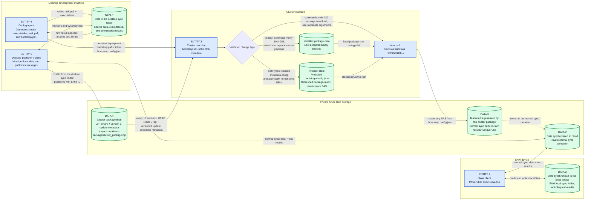

# SyncSAW agent guide

[Project overview](../README.md) | [User manual](USER-MANUAL.md) |
[Development guide](DEVELOPMENT-GUIDE.md) |
[Troubleshooting](TROUBLESHOOTING.md)

This guide is the entry point for coding agents that generate, package, deploy,
or validate cluster workloads. Before changing a cluster workflow, read:

1. The repository [agent safety harness](../AGENTS.md).
2. The
   [`generate-syncsaw-cluster-package` skill](../.github/skills/generate-syncsaw-cluster-package/SKILL.md).
3. The [`task.ps1` contract](../scripts/TASK-PS1.md).

The skill defines the package protocol. `AGENTS.md` and `TASK-PS1.md` define
mandatory safety restrictions.

## Agent responsibilities

The coding agent runs on the same development machine as the SyncSAW desktop
publisher. It:

1. Generates the stable `bootstrap.ps1` deployment script and initial external
   `bootstrap.config.json`.
2. Generates package-root `task.ps1`, cluster executables, test inputs, and
   supporting files.
3. Places package payload files in the desktop sync folder.
4. Waits for a new result ZIP in the local `cluster-results` folder.
5. Analyzes the results and publishes another iteration when needed.

The agent must not start, stop, restart, reinstall, or kill the desktop client;
restart a machine, node, service, or scheduled task; delete cloud Blobs for
validation; or modify existing cluster files. Generated `task.ps1` workloads
must create new files only.

## Entities and data flow

Blue rectangles are active **entities**. Green cylinders are stored **data**.
The lanes show where each entity runs and where each data item resides.



## Cluster package protocol

`scripts\bootstrap.ps1` is the stable Windows PowerShell 5.1 poller for cluster
machines that cannot use an Entra identity. The replaceable workload inside
each package is `task.ps1`. The cluster machine needs no PowerShell 7, Az
modules, Azure CLI, AzCopy, storage key, or interactive login.

The package has one fixed private Blob location:

```text
https://<account>.blob.core.windows.net/<sync-container>-package/cluster_package.zip
```

The desktop creates the `<sync-container>-package` container with public access
disabled and refuses to publish if the container is public. Prefer placing the
complete payload under `<sync-folder>\.syncsaw\package-source`, with
`task.ps1` at that package source root. When this directory exists, the
publisher packages only its contents. If it is absent, the publisher retains
the legacy behavior of building from the selected local folder while excluding
`.syncsaw`, `cluster-results`, reserved package/config names, and cluster-local
`PDITest/PDI.zip` and `PDITest/spdi.zip` datasets. It adds schema-6
`cluster_package.config` and uploads the package with the signed-in desktop
user's Entra credential. The `.syncsaw` directory is excluded from normal
desktop and SAW synchronization.

Root `task.ps1` and `task.config.json` are package-only. Normal desktop and SAW
synchronization exclude them, and manual desktop upload rejects their root
paths. Nested files such as `tools/task.ps1` remain ordinary sync data.

### Update descriptor metadata

Every `cluster_package.zip` upload atomically sets this version-1 descriptor in
Blob metadata. Metadata names and values together must fit within 8,192 UTF-8
bytes.

| Blob metadata key | Required value |
| --- | --- |
| `syncsaw_descriptor_version` | `1` |
| `syncsaw_package_sha256` | Lowercase 64-character SHA-256 of the exact uploaded ZIP |
| `syncsaw_package_built_utc` | UTC round-trip timestamp for the package build |
| `syncsaw_change_type` | `binary` or `commands-only` |
| `syncsaw_execution_command` | Commands-only: Base64-encoded UTF-8 JSON string array; binary: absent |
| `syncsaw_bootstrap_config` | Base64 GZip-compressed UTF-8 schema-6 JSON containing refreshed `PackageUri`, `ResultsBlobUri`, `IssuedUtc`, and `ExpiresUtc` |

The command array cannot select an executable or script. Its fixed prefix is
`powershell.exe -NoLogo -NoProfile -ExecutionPolicy RemoteSigned -File
task.ps1 -BootstrapConfigPath {BootstrapConfigPath}`. Only validated additional
`task.ps1` arguments follow that prefix. Bootstrap replaces the two placeholders
with the current installed package path and protected external config path,
quotes every argument for the native Windows command line, and never invokes a
shell command string.

The bootstrap configuration metadata carries bearer SAS URLs, so it is
security-sensitive even though it is compressed and Base64 encoded. SyncSAW
suppresses the AzCopy metadata argument from operation logs. Never print, copy,
commit, or manually decode it into diagnostics. Bootstrap accepts the prior
uncompressed Base64 form for compatibility, validates both SAS scopes and the
fixed package endpoint, and then atomically updates its protected external
config. On binary updates, the embedded `cluster_package.config` must exactly
match this metadata configuration.

Root `task.config.json` controls publication:

```json
{
  "ResultPrefix": "result",
  "PackageChangeType": "CommandsOnly",
  "ExecutionArguments": ["-Mode", "quick-run", "-Iterations", "2"]
}
```

Use `Binary` or omit `PackageChangeType` whenever `task.ps1`, an executable,
library, input, or any other required package file changed. Use `CommandsOnly`
only when the already installed package contains everything needed and this
round changes only `task.ps1` parameters. A commands-only round does not
download the ZIP or its updated `task.config.json`; the metadata arguments are
the only new execution data consumed by the cluster.

`ExecutionArguments` supports at most 32 strings of at most 1,024 UTF-8 bytes
each, without control characters. It cannot include `-BootstrapConfigPath`.
The complete encoded descriptor must still fit the 8,192-byte metadata budget.
The publisher rejects an invalid or oversized descriptor before upload.

### Required protocol answers

| Agent question | Required answer |
| --- | --- |
| Where is the cluster package read? | `bootstrap.ps1` reads `PackageUri` from its external `bootstrap.config.json`. It must target `https://<account>.blob.core.windows.net/<sync-container>-package/cluster_package.zip`. |
| Which script is executed? | Only package-root `task.ps1`. Binary rounds use the newly installed file; commands-only rounds use the last installed binary package and apply only metadata arguments. |
| How is download versus command-only execution selected? | `bootstrap.ps1` validates `syncsaw_change_type` from Blob metadata. `binary` downloads and hash-verifies the ZIP. `commands-only` never downloads or replaces package files. |
| Where is the refreshed package-read SAS read? | From `PackageUri` in validated `syncsaw_bootstrap_config` Blob metadata. A binary ZIP contains the identical value in schema-6 `cluster_package.config`. |
| Where is the create-only result SAS read? | From `ResultsBlobUri` in validated `syncsaw_bootstrap_config` metadata. The poller atomically persists it to external `bootstrap.config.json` before every binary or command-only task and passes that config path as `-BootstrapConfigPath`. |

## Provision the initial SAS URLs

Enable **Publish cluster package on changes and daily** in the desktop app and
run **Sync now** once. Copy `scripts\bootstrap.ps1` and
`scripts\bootstrap.config.json` to the cluster machine.

On the signed-in management computer, create the first seven-day exact-Blob
read-only package SAS and a matching exact-Blob create-only result SAS:

```powershell
$start = (Get-Date).ToUniversalTime().AddMinutes(-5)
$expiry = $start.AddDays(7)
az storage blob generate-sas `
  --account-name contosodata `
  --container-name releases-package `
  --name cluster_package.zip `
  --permissions r `
  --start $start.ToString('yyyy-MM-ddTHH:mm:ssZ') `
  --expiry $expiry.ToString('yyyy-MM-ddTHH:mm:ssZ') `
  --https-only --auth-mode login --as-user --full-uri --output tsv

$resultName = "cluster-results/initial-$([guid]::NewGuid().ToString('N')).zip"
az storage blob generate-sas `
  --account-name contosodata `
  --container-name releases `
  --name $resultName `
  --permissions c `
  --start $start.ToString('yyyy-MM-ddTHH:mm:ssZ') `
  --expiry $expiry.ToString('yyyy-MM-ddTHH:mm:ssZ') `
  --https-only --auth-mode login --as-user --full-uri --output tsv
```

Put both complete URLs in the cluster machine's `bootstrap.config.json`. Never
commit them or transfer them over an untrusted channel.

```json
{
  "PackageUri": "https://contosodata.blob.core.windows.net/releases-package/cluster_package.zip?sp=r&...",
  "ResultsBlobUri": "https://contosodata.blob.core.windows.net/releases/cluster-results/initial.zip?sp=c&...",
  "IntervalSeconds": 10,
  "TaskExecutionRoot": "",
  "TaskExecutionPath": "K:\\Tasks",
  "OutputPath": "K:\\Results"
}
```

Protect the file with Administrators/SYSTEM-only Windows ACLs, then start it
from elevated 64-bit Windows PowerShell 5.1:

```powershell
powershell.exe -NoLogo -NoProfile -ExecutionPolicy RemoteSigned -File `
  .\bootstrap.ps1
```

`TaskExecutionRoot` defaults to the directory containing `bootstrap.ps1`. An
explicit value must be that directory or one of its subdirectories. The runner
rejects network/removable drives and reparse points and protects each working
directory with Administrators/SYSTEM-only ACLs.

## Poll, roll over, and execute

The runner performs an HTTPS `HEAD` check every 10 seconds by default. It
validates the complete versioned update descriptor before deciding what to do.
A matching ETag means no work; otherwise Blob Last Modified must be strictly
newer than completed state.

| Descriptor | Bootstrap action |
| --- | --- |
| `binary` | Persist validated metadata SAS rollover, download with `If-Match`, verify the exact ZIP SHA-256, require the embedded config to match metadata, validate/extract, and run the newly installed `task.ps1`. |
| `commands-only` | Persist validated metadata SAS rollover, but do not download, extract, replace files, or read the new ZIP configuration. Require a previously installed binary package and run its existing `task.ps1` with the validated metadata arguments. |

A commands-only descriptor on a new cluster, after installed state is lost, or
when the prior package directory/task is missing is rejected. Publish a
`Binary` descriptor to establish or recover the package. Bootstrap records a
descriptor's ETag only after its task exits, so a failed start is retried and a
successful command round is not replayed on every poll.

Before extraction, the runner limits archive size, expanded size, and entry
count; blocks ZIP traversal and reparse points; applies restricted ACLs; and
validates schema 6 and the additive-only task harness.

Every descriptor contains the next seven-day package-read SAS and one exact
result upload SAS in `syncsaw_bootstrap_config`; binary ZIPs carry an identical
copy in `cluster_package.config`. The poller verifies that the refreshed package
SAS still targets the same fixed Blob and that the result SAS targets an exact
`cluster-results/<unique>.zip` Blob in the same storage account. It atomically
updates the rollover fields in external `bootstrap.config.json` before task
execution. The desktop republishes unchanged payloads every 24 hours as a binary update,
providing a six-day rollover overlap; payload changes publish on the next sync
cycle. Commands-only rounds can therefore receive a new one-use result upload
SAS without downloading the ZIP. The first publication after the desktop starts
is also forced to binary because in-memory publication history is unavailable;
change `ExecutionArguments` after that baseline to issue a command-only round.

The poller starts package-root `task.ps1` in child 64-bit Windows PowerShell 5.1
with `-BootstrapConfigPath` pointing to the external config. While the task is
active, polling, download, and start work are skipped. A single-instance mutex
prevents overlapping pollers. Completed state stores both the descriptor hash
and the last installed binary hash after the task exits; `-Once` waits for a
started workload to finish.

## Return test results

The packaged `task.ps1` reads `ResultsBlobUri` only from the supplied
`BootstrapConfigPath`. The URL identifies one unique
`cluster-results/<timestamp-guid>.zip` Blob in the normal sync container. It is
an HTTPS-only user delegation SAS with exact create-only permission (`sp=c`,
`sr=b`). Upload uses `If-None-Match: *`, so the workload cannot list, read,
overwrite, or delete any Blob.

The desktop and `Sync-SAW.ps1` automatically download the result ZIP to their
monitored folders. The coding agent detects it on the desktop, analyzes it, and
can publish the next iteration.

The selected sync container name must be 55 characters or fewer so the
`-package` suffix remains a valid Azure container name.

## Iteration procedure

1. Put `task.ps1`, task-specific `task.config.json`, required executables, test
   inputs, and supporting files in the selected desktop sync folder. Compress
   executable output into one package file where practical. Do not put secrets
   in the payload. Keep general `TaskExecutionPath` and `OutputPath` settings in
   external `bootstrap.config.json`.
2. Set `PackageChangeType` to `Binary` for any package-file change. Set it to
   `CommandsOnly` only for a parameter-only round against an already installed
   binary, and put the new argument tokens in `ExecutionArguments`.
3. Let the desktop synchronize changes and publish the package plus descriptor to the private
   package container. Do not restart or manipulate the desktop process.
4. Wait for a new ZIP under the local `cluster-results` folder.
5. Extract and analyze the result ZIP.
6. Update the task, binary payload, or command arguments and repeat.

`task.ps1` is responsible for running the test workload and compressing all
output into one result ZIP. Before packaging, validate it:

```powershell
powershell.exe -NoLogo -NoProfile -ExecutionPolicy RemoteSigned -File `
  .\scripts\Test-TaskScriptSafety.ps1 -Path <path-to-task.ps1>
```

The bootstrap runner applies the same static check immediately before
execution. This is defense in depth, not a security boundary: packaged native
executables run as local administrator and must be trusted.

## Security and lifecycle constraints

- Anyone allowed to replace `cluster_package.zip` can cause `task.ps1` to run
  as local administrator. Use a dedicated storage account/container and treat
  package write access as privileged code-deployment access.
- SAS rollover comes from validated descriptor metadata for both update types.
  If the desktop does not publish for seven days, manually replace both SAS
  URLs in external `bootstrap.config.json`.
- Descriptor metadata is trusted deployment control data. Blob write or
  metadata-write access is equivalent to permission to choose administrator
  task arguments.
- Schema 6 and descriptor version 1 are incompatible with legacy package
  runners. Stop the old runner,
  deploy the current scripts/config, publish to the singular `-package`
  container, provision both initial SAS URLs, and then start the new runner.
- Do not point schema-2 through schema-5 runners at schema-6 packages.

For failures, logs, and non-destructive diagnostic steps, use the shared
[troubleshooting guide](TROUBLESHOOTING.md).
